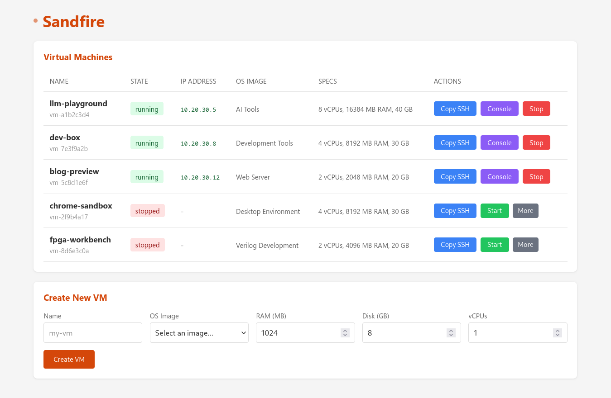

# Sandfire

Sandfire is a service that lets you create isolated environments for AI coding agents or any other ephemeral workload. It uses [Firecracker](https://firecracker-microvm.github.io/) to create fast, secure microVMs.

These environments can be preconfigured (using the companion [layercake](./layercake) tool) with your codebase and tools already installed. This means it's easy to launch several VMs and have multiple agents trying different things all at once.

VMs also get their own subdomain and run a reverse proxy, so you can access any web-based services running inside the VM. (And this means agents can provide you with a link to preview their work.)



<details>
<summary><b>Why not containers/Docker?</b></summary>

I did not feel that containers provided the right level of isolation. Also, I wanted to run applications that use Docker containers or Docker Compose inside the isolated environment. Nesting Docker inside Docker is complex and risky. But running Docker inside a microVM is easy, just install it like you normally would!

The main downside is that you have to make your own VM images, although [layercake](./layercake) can help with that. You can also make a VM image that just installs Docker and then runs your application's containers.

</details>

## Features

- Firecracker VMM with jailer for security isolation
- Fast VM startup times (a few seconds)
- Web interface and REST API for VM management (including web VNC access to the VMs)
- Web proxy to route different subdomains to each VM
- SSH proxy to allow SSH-ing into each VM

## Requirements

- Linux with KVM support (`/dev/kvm` must be accessible)
- Firecracker and jailer installed (https://github.com/firecracker-microvm/firecracker)
	- On Arch-based systems, you should use the [binaries from the latest Firecracker release](https://github.com/firecracker-microvm/firecracker/releases/latest) instead of the Arch package.
	- This is because the Arch package is built with glibc which isn't supported by the jailer.
- Root privileges (for network configuration and jailer)
- Go 1.25+ (for building)
- `debootstrap` (for layercake to build images)
	- On Arch this can be installed via pacman.

## Quick Start

You should make sure you cloned the repository with `--recursive`. If you didn't, you can also run the command `git submodule update --init --recursive` to clone the submodules.

### 1. Build Sandfire

```bash
go build -o sandfire ./cmd/sandfire
```

### 2. Start Sandfire

```bash
sudo ./sandfire
```

### 3. Build Layercake

The companion [layercake](./layercake) tool helps with building VM images.

```bash
cd layercake
go build -o layercake ./cmd/layercake
```

### 4. Build VM images

From the layercake folder, build the various layers. Sudo is required because it uses `chroot`. Once done, the export command registers the images with Sandfire.

```bash
./layercake status
sudo ./layercake build -all
./layercake export ../data
```

You can now go to the Sandfire web UI at http://localhost:9000 and try creating some VMs!

### Additional setup

* Define more layers in [layercake](./layercake/README.md)
* Build and run [sshproxy](./sshproxy) for easier SSH access

## Configuration

Sandfire uses the following defaults:

| Setting | Value | Description |
|---------|-------|-------------|
| Port | 9000 | HTTP API port |
| Data Directory | `./data` | Storage for database, images, and VM disks |
| Bridge Name | `sandfire0` | Network bridge interface |
| Bridge IP | `10.20.30.1/24` | Bridge network |
| VM IP Range | `10.20.30.2-254` | IP addresses assigned to VMs |

## Accessing the VMs

Each VM gets an IP address from the 10.20.30.0/24 range and has an SSH server running.

VMs have these users by default:

| Username | Password |
|----------|----------|
| root | sandfire |
| sandfire | sandfire |

It's recommended to also set up the companion [sshproxy](./sshproxy) tool, which allows accessing the VMs remotely.

## Companion tools

In this same repository are two additional tools that help with using Sandfire VMs:
* [layercake](./layercake) - build VM root filesystems using multiple "layers", similar to Docker containers
* [sshproxy](./sshproxy) - provide a single SSH server that can forward connections (and ports) to any running VM
